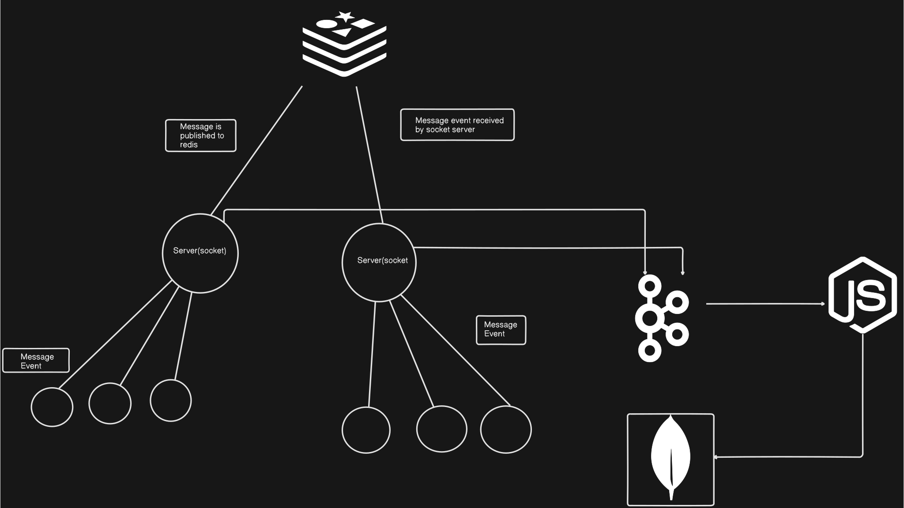

# Real-Time Chat Application

## Introduction
This real-time chat application allows users to communicate seamlessly with each other. It incorporates features for user authentication, real-time messaging, and online status tracking. The application is designed to scale efficiently using Redis and Kafka.




## Features
- User authentication
- Real-time messaging
- Online/offline status tracking
- User discovery and chat addition
- Data storage in MongoDB
- Scalable using Redis and Kafka

## Tech Stack
- Node.js
- Next.js
- Socket.io
- MongoDB
- Redis
- Kafka

## Installation
To install the application, use the following command with pnpm:

```bash
pnpm install
```

## Running the Application
To start the application, use the following command:

```bash
pnpm run dev
```


